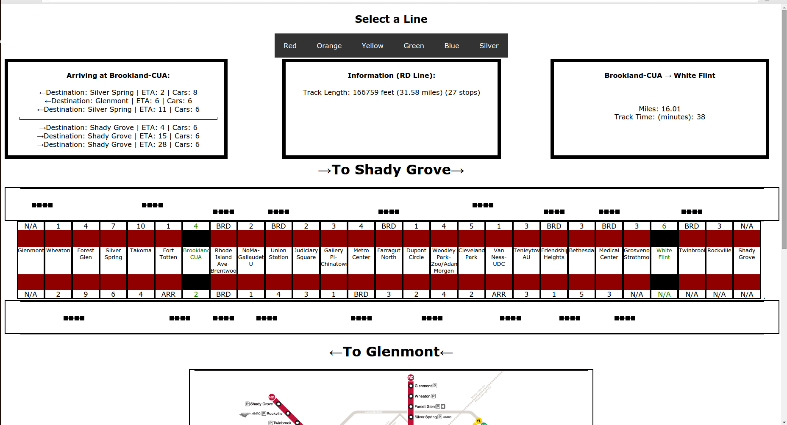

#DC TRAINS

##[Hosted on Heroku](https://infinite-spire-8251.herokuapp.com/)

##Installation:

*  Clone this repo.
*  Run `npm install`.
*  Run `node index.js` / `nodemon`.
*  Go to localhost:3000.
*  You will need to supply [your own api key for wmata](https://developer.wmata.com/).  This should be set as either as a process variable `process.env.KEY` or in a js file called env exporting a js object like this  `modules.exports = {KEY: "your key here"}`.

##How to Use

*  Click a line link to populate data.
*  The number on each station shows the time in minutes before the next train's arrival.  
*  Both tracks are shown, one above the station list and one below.
*  The middle div shows general information about the line you've selected and alerts if there are any.
*  The left div displays all incoming trains to the station that you select (by clicking on it).
*  The right div shows the path between two stations.  Click two stations to see a time estimate and a distance estimate between them.
*  Data updates every 10 seconds.
*  If many/all stations have N/A and no trains are rendered this is probably because wmata's api is down.  Probably.

##Train Estimates

*  All estimates are based on wmata's api.
*  The trains rendered on the screen are estimates and the lines are not to scale.  
*  Train movement is for visual effect only.

##Technologies

*  Node/Express/Angular/Mongoose/many Node packages (see package.json).
*  No DB currently attached. Currently there is no data that I wanted to store.
*  Because Models were built with Mongoose schemas, a DB could easily be attached.

##Issues

Angular is very complicated.  I didn't understand angular as well as I thought I did going into this project, specifically how two-way data binding actually works.  Because of this I ran into problems during development using `ng-repeat` incorrectly (I treated ng-repeat like a for loop that would be executed once each time data is updated -- don't do this, it's very bad.  Ng-repeat will likely run much more than you expect). I generally didn't understand how `$digest` cycles work to keep data synchronous across multiple scopes or how to use `$watch`.

Fortunately, I was able to figure these things out as I went and ended up learning a lot about angular in the process.  

One aspect of the project that isn't visible on the surface is how much effort went into making a model for the entire metro system.  I spent a lot of time constructing a large json to hold all the information about each line.  Since this is static data, I only needed to generate it once, but you could use this data to add onto the project (perhaps by persisting some data over time and looking at patterns over weeks and months).

I spent a lot of time thinking about how to determine where trains are on a line, and how to render them.  The method that I ended up using isn't perfect.  What I hoped to do was keep a trains array for each line and update it when the data updates.  However, I didn't have enough time to implement this (hopefully later!) so I ended up removing and re-rendering trains after each update.

Finally, I didn't deal with the fact that many tracks in the Metro are shared between lines.  I anticipated this issue early in the project, but I didn't get around to accounting for it.  As is, each line is handled separately so you won't see blue line trains on the yellow line, even if they share a track.

See `user.stories.md` for more information about development.
